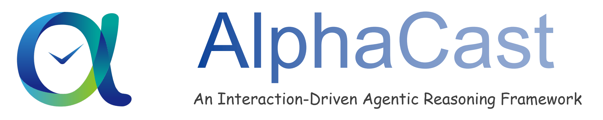
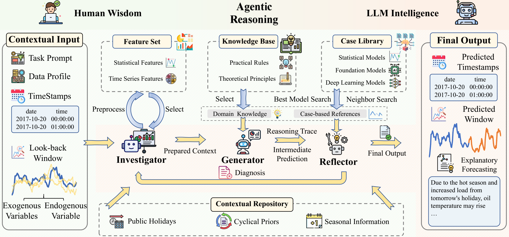
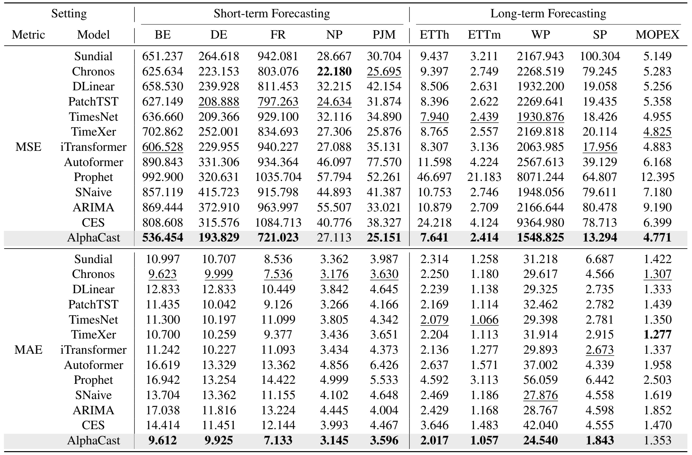

<!-- <h1 align="center"> 🌟 AlphaCast: An Agentic Human Wisdom–LLM Intelligence 

Co-Reasoning Framework for Cognitive Time Series Forecasting. </h1> -->

<p align="center"></p>


## 🧠 Overview

AlphaCast is an **interaction-driven agentic reasoning** framework for time series forecasting. Instead of treating forecasting as a static, one-shot regression task, AlphaCast models it as an expert-like, multi-turn process powered by **training-free LLMs**. It organizes inference into a three-stage workflow: **(1) context extraction** (features, knowledge, attributes, and case-based references), **(2) reasoning-based generation** (produce an intermediate forecast with evidence-grounded adjustments), and **(3) reflective evaluation and refinement** (contract/evidence checks with iterative correction and a fallback strategy when needed). To support reliable reasoning, AlphaCast provides a lightweight toolkit including a **feature set**, **knowledge base**, **contextual pool**, and **case library**.

<p align="center"></p>

## 🔥 Key Features

- **Interaction-Driven, Multi-Stage Inference**: Reformulates forecasting from one-shot prediction into a three-stage pipeline (context extraction → reasoning-based generation → reflective evaluation & refinement) for iterative, expert-like forecasting.

- **Evidence-Grounded Context Construction**: Builds a consolidated context from task/data profiles, timestamps, endogenous/exogenous sequences, selected temporal features, retrieved knowledge, case-based references, and supplementary context.

- **Lightweight Toolkit for Reasoning Support**: Provides a modular toolkit (feature set, knowledge base, contextual pool, and case library) that supplies external evidence without model training.


- **Reflective Verification with Fallback**: Performs checks to reduce unsupported adjustments and iteratively refine forecasts.

## 🚀 Easy Experiments


To quickly reproduce our experiments, follow these simple steps:

1. **Prepare environment & data**
   - Set up all checkpoints for deep learning models and foundation models.
   - Set up your data folder.

2. **Create and activate conda environment**

```bash
conda create -n AlphaCast python=3.9 -y
conda activate AlphaCast
```

3. **Install dependencies**

```bash
pip install -r requirements.txt
```

4. **Run experiments**

```bash
python run_experiment.py
```

## 🧪 Experimental Results

AlphaCast consistently achieves the best performance across most datasets, demonstrating a significant advantage over statistical baselines, recent deep learning models, and foundation models. The following figure presents its experimental results in both short-term and long-term forecasting.
<p align="center"></p>

## 🤝 Contributors

**Student Contributors**: [**Xiaohan Zhang**](https://github.com/echo01-ai), [**Tian Gao**](https://github.com/SkyeGT), [**Bokai Pan**](https://github.com/Forever-Pan), [**Ze Guo**](https://github.com/Kawai1Angel), [**Yaguo Liu**](https://github.com/liuyaguo), [**Xiaoyu Tao**](https://github.com/Xiaoyu-Tao), [**Jiahao Wang**](https://github.com/realwangjiahao)

**Supervisors**: [**Mingyue Cheng**](https://mingyue-cheng.github.io/)

**Affiliation**: **State Key Laboratory of Cognitive Intelligence, University of Science and Technology of China**

## 🥰 Acknowledgements

We would like to express our sincere appreciation to the creators of [Pydantic AI](https://ai.pydantic.dev/) and [thuml/TimeSeriesLibrary](https://github.com/thuml/Time-Series-Library) for providing such a robust framework, which has been integral to the success of our project. Additionally, we are deeply thankful for the insightful feedback and contributions from the collaborators of this work, including Xiaohan Zhang, Tian Gao, Bokai Pan, Ze Guo, Yaguo Liu, Xiaoyu Tao, and Jiahao Wang. It is their dedicated efforts and invaluable contributions that have made this work possible.

